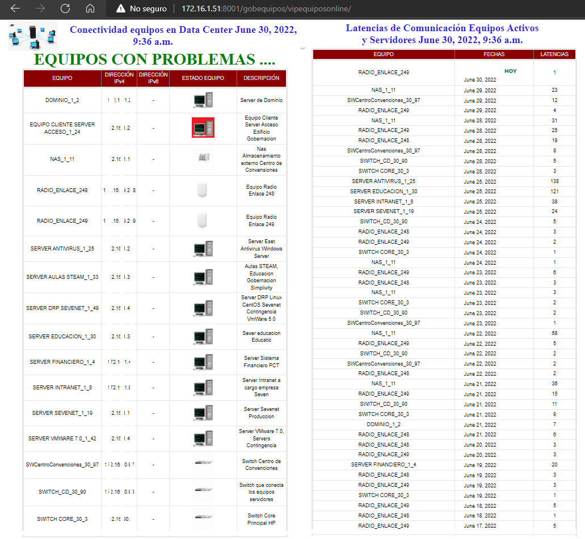
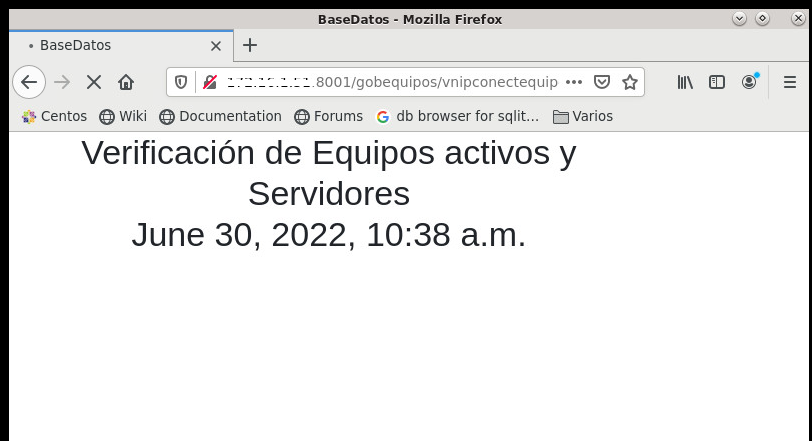

# netequipos
<h3>
  Netequipos. Aplicación simple que permite censar los equipos de una red de datos ejecutando un solo ping por vez al equipo de computo 
</h3>
<h3> align="center" style="color:blue; background-color:powderblue;">
     
  
     Se ejecuta en la ruta http://127.0.0.1:8001/gobequipos/vipequiposonline/, cuando se hace de forma local, y remoto colocando 
     la dirección ip del servidor donde se encuentra instalado. Trabaja en dos mabitos el mencionado requiere que que la base de datos 
     Postgresql se esté actualizando cada tiempo de manera que se pueda validar que equipos estan o no están respondiendo
     http://127.0.0.1:8001/gobequipos/vnipconectequipos
 </h3>
  

          
  

