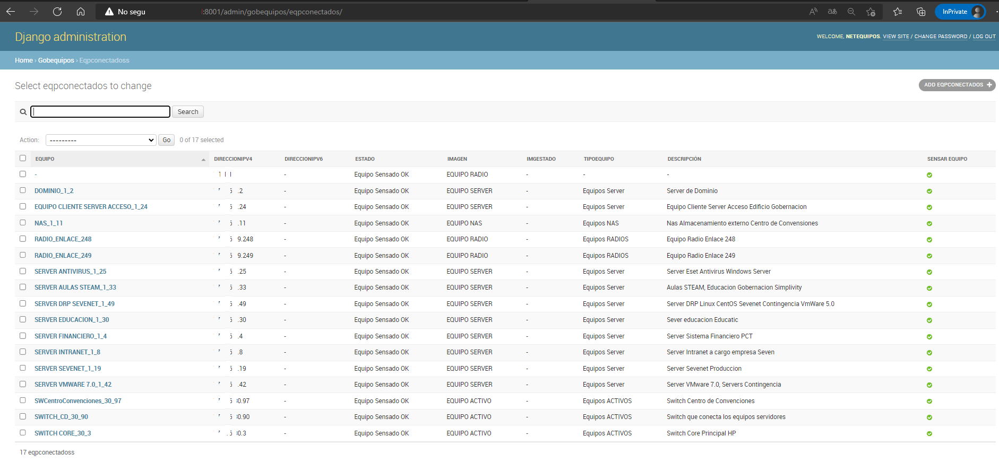

# netequipos
<h3>
  Netequipos, nuestra primera aplicació. Aplicación simple que permite censar los equipos de una red de datos ejecutando un solo ping por vez al equipo de computo. 
  Es una aplicación hecha con Python 3 y postgres 9.4 como base de datos 
</h3>

  La aplicación trabaja en dos ambitos una actualizando la base de datos  
  http://127.0.0.1:8001/gobequipos/vnipconectequipos, la dirección local host para que donde está instalada la aplicación actualice la base de datos 
  postgres con los registros a censar.      

 

        

En segunda instancia y de frente al usuario, se ejecuta en la ruta http://127.0.0.1:8001/gobequipos/vipequiposonline/, cuando se hace de forma local, pero si la   ejecución se hace fuera del equipo local
  debemos colocar la dirección del equipo donde está la aplicación.  
               
 

 
 

    Los registro a censar la conectividad, se agregan desde la consola de administración de python 
        

